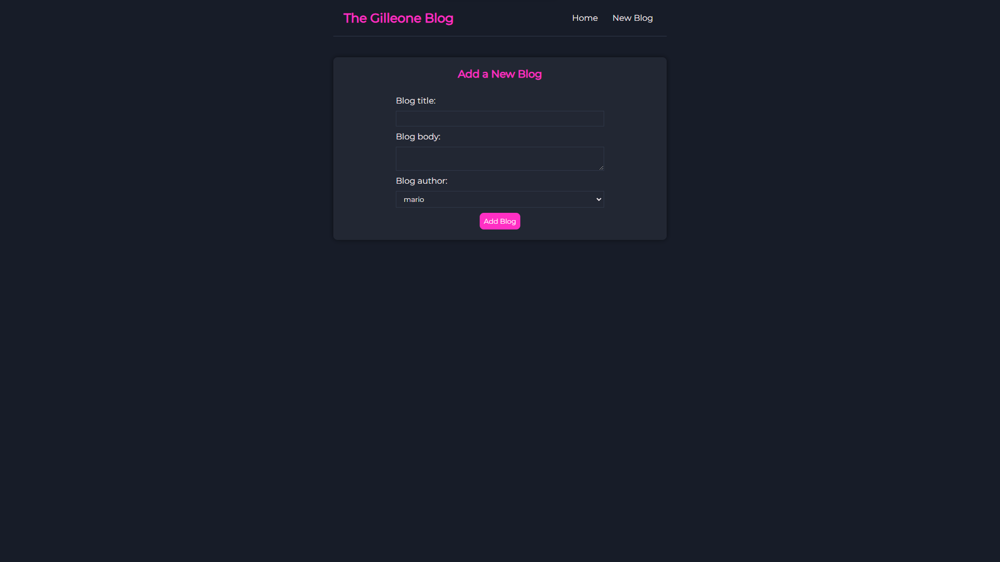

# React Gilleone Blog

This repository contains a sample blog built with React.





## Installation

To get started with this project, follow these steps:

1. Clone the repository to your local machine:

    ```
    git clone https://github.com/your-username/react-gilleone-blog.git
    ```

2. Navigate to the project directory:

    ```
    cd react-gilleone-blog
    ```

3. Install dependencies:

    ```
    npm install
    ```

## Running

To run the project, execute the following commands:

1. Start the React application:

    ```
    npm start
    ```

2. Launch the JSON server to mimic the API:

    ```
    npx json-server --watch data/db.json --port 8000
    ```

These commands will start the React blog and a virtual server that will serve data for the blog.

